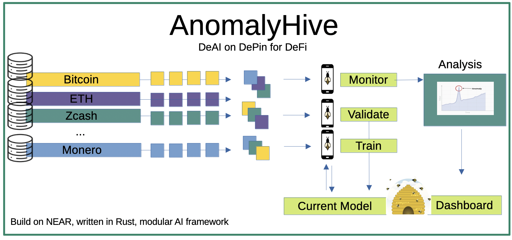
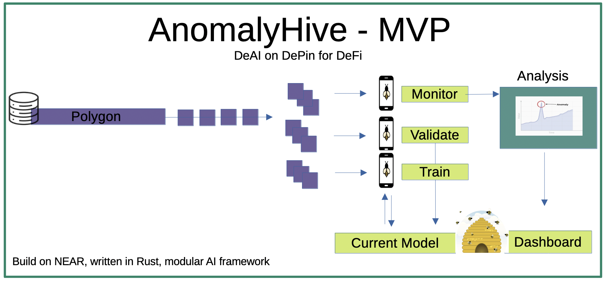
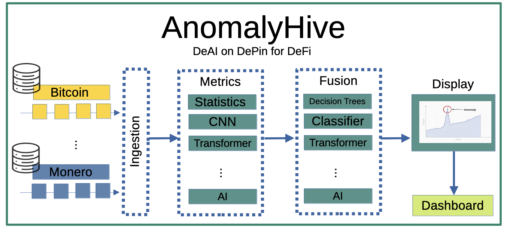

# AnomalyHive
Federated learning, on-chain for collaborative + distributed training of anomaly detection models.

## The Main Elements
What's normal crypto behavior and what's sketchy? AnomalyHive aims to build a modular, extensible framework for federated learning specifically designed for blockchains, leveraging Rust's security features for distributed, collaborative ML model training. 

The first-gen pipeline features a Data Ingestion Block, followed by a Metrics Block that applies statistical and ML algorithms to produce rich feature vectors, culminating in Data Fusion that categorizes behavioral patterns and assigns anomaly probabilities. 

Although we're starting with labeled fraud, the pipeline will be built with modular components to enable anomaly detection for other applications. The federated approach distributes computational load across the network with each node processing a chunk of a blockchain instead of requiring massive centralized infrastructure. Future participants could earn tokens for contributing processing power to the collective detection effort. 

AnomalyHive, a neighborhood watch for DeFi on DePin, where everyone gets paid to keep their eyes open and the hive handles the orchestration.

## The Start

- See MVP_TASKS.md
- See TASK_DETAILS.md

## The Next Level Down 

## Hear Me talk About it

[Watch the AnomalyHive Promo Video](docs/AnomalyHive_promo_low.mp4)

## Resources
Federated Learning on NEAR: https://github.com/kamalbuilds/decentralised-federated-learning-platform

2024: https://medium.com/@NearKoreaHub/democracy-of-ai-the-future-of-intelligent-systems-e8461db64d7c

Mention of DeAI: https://nillion.com/news/near-protocol-and-nillion-where-privacy-meets-performance/

Study of it: https://www.mdpi.com/1999-5903/15/12/400

ML in Rust: https://github.com/vaaaaanquish/Awesome-Rust-MachineLearning
